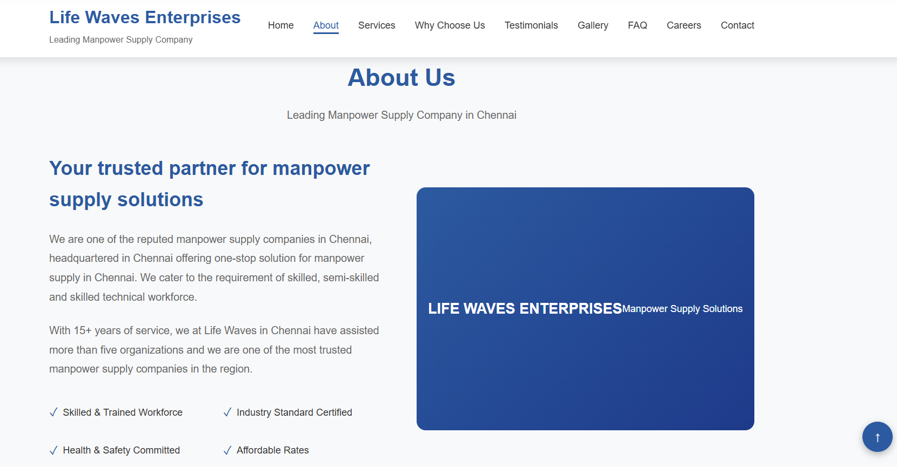
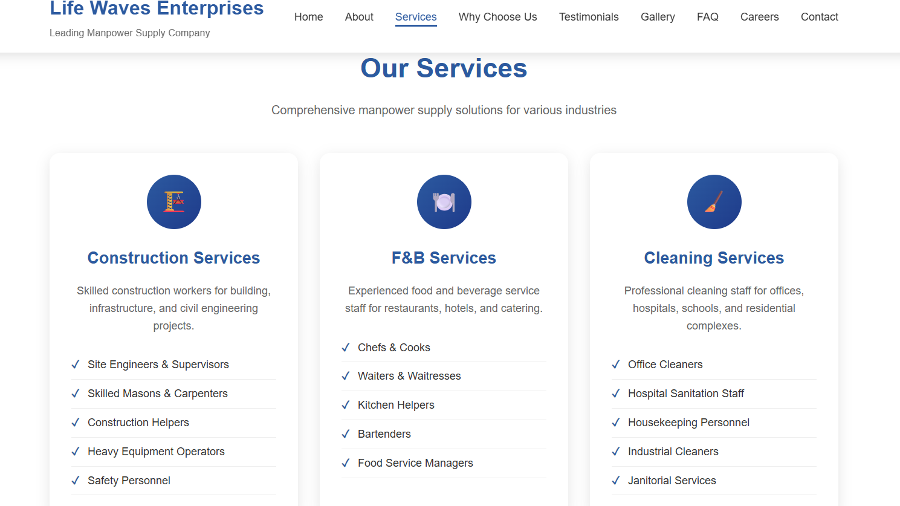
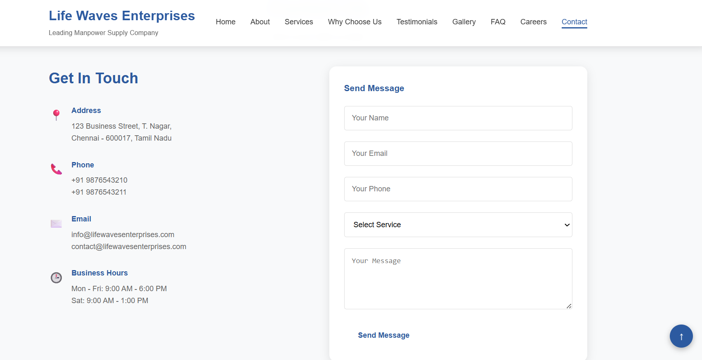

# 👷 Manpower Supply Management

A web-based **Manpower Supply Management System** developed to streamline workforce operations by managing employees, client requests, and manpower allocation through a modern and responsive interface.

---

## 📖 About the Project

The **Manpower Supply Management** application is designed to simplify the daily operations of manpower supply agencies. It enables organizations to efficiently manage employee records, client requirements, and workforce allocation through a centralized platform.

The project aims to improve operational efficiency, reduce manual work, and provide an easy-to-use solution for manpower management.

---

## ✨ Key Features

- 👨‍💼 Employee Management
- 🏢 Client Management
- 📋 Workforce Allocation
- 📞 Contact Information
- 🌐 Responsive Web Design
- ⚡ User-Friendly Interface
- 📱 Mobile-Friendly Layout

---

## 🛠 Technologies Used

- HTML5
- CSS3
- JavaScript
- SVG Icons

---

## 📂 Project Structure

```text
Manpower-Supply-Management/
├── index.html
├── style.css
├── script.js
├── icons.svg
├── home.png
├── about.png
├── services.png
├── contact.png
└── README.md
```

---

## 🚀 Getting Started

### Clone the Repository

```bash
git clone https://github.com/Monishaksiva/Manpower-Supply-Management.git
```

### Run the Project

1. Open the project folder.
2. Open `index.html` in any modern web browser.
3. Explore the application.

---

## 📸 Project Screenshots

### 🏠 Home Page


### ℹ️ About Page



### 🛠 Services Page



### 📞 Contact Page



---

## 🎯 Project Objectives

- Simplify manpower management operations.
- Organize employee and client records.
- Improve workforce allocation.
- Enhance operational efficiency.
- Provide a responsive and intuitive user experience.

---

## 💡 Future Enhancements

- 🔐 User Authentication
- 👨‍💼 Admin Dashboard
- 📊 Employee Attendance Tracking
- 📅 Project Assignment Module
- 🗄 Database Integration
- 📈 Reports and Analytics
- 📧 Email Notifications

---

## 👩‍💻 Developed By

**Monisha S**

🎓 Computer Science and Engineering Student


---

⭐ If you like this project, consider giving it a **Star ⭐** on GitHub.
